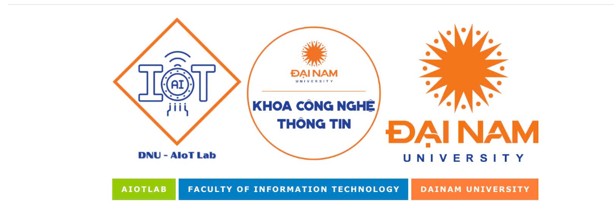

# 🛣️ PHÁT HIỆN Ổ GÀ TRÊN ĐƯỜNG BẰNG DEEP LEARNING

---

## � Hệ thống Xác Thực Blockchain

Hệ thống phát hiện ổ gà tích hợp công nghệ **Blockchain** để xác thực, lưu trữ và chia sẻ dữ liệu phát hiện một cách minh bạch và bất biến.

---

## 📌 Tính năng Blockchain
- **Xác thực dữ liệu**: Mỗi phát hiện ổ gà được ghi lại trên blockchain với hash duy nhất.  
- **Minh bạch & Bất biến**: Toàn bộ dữ liệu phát hiện được lưu trữ công khai, không thể chỉnh sửa hay xóa.  
- **GPS + Blockchain**: Mỗi phát hiện kèm theo tọa độ GPS chính xác và thông tin blockchain.  
- **Xác thực cộng đồng**: Cộng đồng người dùng có thể xác minh và quản lý các báo cáo ổ gà.  

---

## 🖥️ Kiến trúc Blockchain
- **Blockchain**: Sepolia Testnet (Ethereum)
- **Smart Contract**: PotholeHashRegistry.sol  
- **Dữ liệu lưu trữ**: Hình ảnh, vị trí GPS, hash blockchain, timestamp
- **Công khai**: Tất cả dữ liệu có thể xem tại: [Blockchain Explorer](link_sepolia_testnet)

---

## 🔍 Giao diện Xác Thực

Giao diện cho phép người dùng xem danh sách các phát hiện ổ gà cùng thông tin blockchain:
- Ảnh phát hiện
- Thời gian ghi lại (timestamp)
- Tọa độ GPS
- Hash blockchain (SHA-256 trên Sepolia Testnet)
- Nút "Xác Thực" để kiểm tra trên blockchain

---

## 📊 Các Ảnh Phát Hiện

Hệ thống hiển thị bộ sưu tập các ổ gà được phát hiện:
- **Frame ID**: Định danh khung hình
- **Thời gian**: Ngày giờ phát hiện
- **Vị trí GPS**: Tọa độ chính xác (lat, lon)
- **Hash Blockchain**: Mã hash xác thực trên blockchain
- **Nút Xác Thực**: Liên kết trực tiếp đến Sepolia Testnet

---

## ⚙️ Công nghệ sử dụng
- **AI/ML**: YOLOv8, OpenCV, PyTorch  
- **Blockchain**: Solidity, Web3.py, Sepolia Testnet  
- **Backend**: Python, Flask  
- **Frontend**: HTML, CSS, JavaScript  
- **GPS**: Định vị toàn cầu, Tọa độ kinh vĩ độ  

---

## 🔐 Quy trình Xác Thực
1. **Phát hiện**: YOLOv8 phát hiện ổ gà từ video
2. **Ghi GPS**: Lấy tọa độ GPS hiện tại
3. **Tính Hash**: Tạo SHA-256 từ dữ liệu ảnh + GPS
4. **Ghi Blockchain**: Lưu hash lên Sepolia Testnet thông qua PotholeHashRegistry
5. **Công khai**: Dữ liệu có thể truy cập công khai trên blockchain explorer

---

## 📌 Ưu điểm của Blockchain
✅ **Minh bạch**: Toàn bộ dữ liệu công khai, có thể kiểm chứng  
✅ **An toàn**: Dữ liệu được mã hóa và bất biến  
✅ **Phân tán**: Không phụ thuộc vào máy chủ tập trung  
✅ **Truy cập**: Bất kỳ ai cũng có thể xác minh và truy cập dữ liệu  
✅ **Ứng dụng**: Hỗ trợ quản lý hạ tầng giao thông hiệu quả  

---

## 👤 Tác giả
- Họ tên: Trần Dương Anh 
- Lớp/Khoa: CNTT 17-05 - Đại học Đại Nam  

