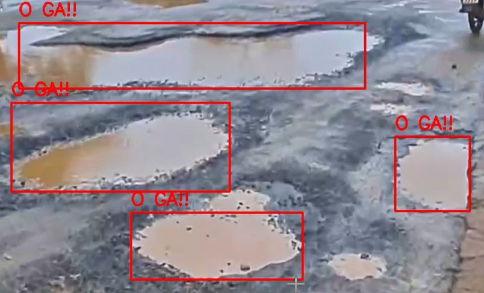

# 🛣️ PHÁT HIỆN Ổ GÀ TRÊN ĐƯỜNG BẰNG DEEP LEARNING

---

## 📌 Ứng dụng trí tuệ nhân tạo trong giao thông thông minh

Hệ thống phát hiện ổ gà từ camera điện thoại theo thời gian thực sử dụng mô hình YOLOv8 và OpenCV.

---

## 🔍 Giới thiệu
Ổ gà trên đường là nguyên nhân gây nguy hiểm cho người tham gia giao thông, đặc biệt với xe máy.  
Đề tài hướng đến xây dựng hệ thống có thể **tự động nhận diện ổ gà** từ video camera gắn trên phương tiện,  
từ đó cảnh báo người lái, góp phần nâng cao an toàn và giảm tai nạn.

---

## 🏗️ Kiến trúc hệ thống
Hệ thống gồm 5 bước chính:

1. **Thu thập dữ liệu**: Quay video thực tế bằng điện thoại trong điều kiện trời sáng.  
2. **Tiền xử lý & gắn nhãn**: Tách ảnh từ video, dùng LabelImg để vẽ khung quanh ổ gà.  
3. **Huấn luyện mô hình**: Sử dụng YOLOv8 (PyTorch), tinh chỉnh tham số (epoch, batch size, learning rate).  
4. **Đánh giá mô hình**: Sử dụng các chỉ số mAP, Precision, Recall.  
5. **Triển khai**: Tích hợp mô hình với OpenCV để phát hiện ổ gà từ video thời gian thực.

---

## ⚙️ Tính năng chính
- Nhận diện ổ gà trực tiếp từ video camera.  
- Hiển thị khung bao quanh ổ gà và độ tin cậy (confidence score).  
- Có thể triển khai trên laptop hoặc tối ưu để chạy trên điện thoại (TFLite, CoreML).  
- Dễ mở rộng với dữ liệu nhiều điều kiện thời tiết (mưa, tối).  

---

## 🖥️ Công nghệ sử dụng
- **Python/Visual_Studio_Code**
- **PyTorch**
- **Ultralytics YOLOv8**
- **OpenCV**
- **LabelImg / Roboflow**

---

## 📊 Kết quả thử nghiệm

Ví dụ nhận diện ổ gà trên đoạn đường thực tế:

- Độ chính xác (mAP): ~80%  
- Tốc độ xử lý: ~80 FPS trên GPU  

Mô hình có khả năng nhận diện ổ gà rõ ràng trong điều kiện trời sáng.  
Một số hạn chế: dễ nhầm với vết dầu, bóng tối; khó phát hiện khi ổ gà nhỏ hoặc bị nước che phủ.  

---

## 📌 Kết luận & Hướng phát triển
- Đề tài cho thấy khả năng ứng dụng học sâu trong việc hỗ trợ an toàn giao thông.  
- Trong tương lai có thể:
  - Bổ sung dữ liệu ban đêm, trời mưa.  
  - Kết hợp GPS để xác định vị trí ổ gà.  
  - Triển khai ứng dụng di động cảnh báo trực tiếp cho người lái.  

---

## 👤 Tác giả
- Họ tên: Trần Dương Anh 
- Lớp/Khoa: CNTT 17-05 - Đại học Đại Nam  

